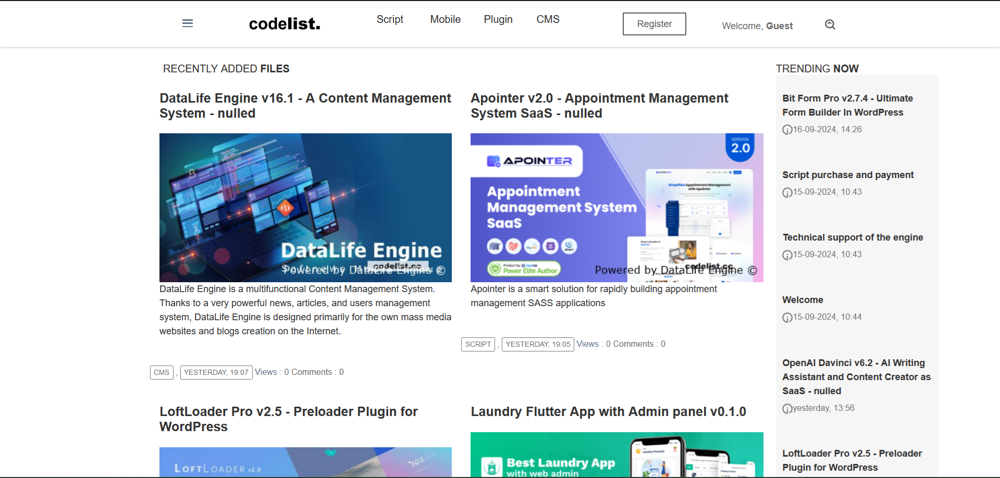
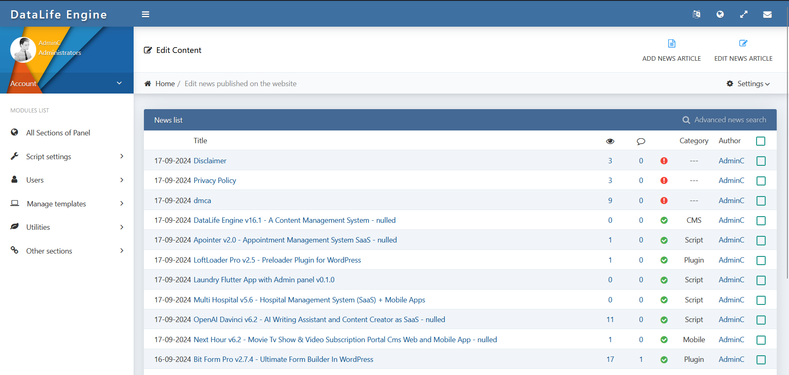

# CODELIST TEMPLATE DATALIFE ENGINE DLE

dle adalah CMS Blog Posting Keren.

## Tahap Pengembangan

DLE belum dapat digunakan untuk produksi dan sedang dalam proses pengembangan.

## Minimum Requirement

- [X] PHP versi 7.1.7 atau Terbaru
- [X] MYSQLSQL Database minimal versi 9.6
- [X] Web Server (Apache, Nginx atau IIS)

**NOTE**: 

- [X] Sistem ini dikembangkan menggunakan lingkungan pengembangan WINDOW, pengembang tidak menjamin jika sistem ini dapat berjalan dengan baik pada sistem operasi lain.
- [X] Walaupun dapat berjalan pada DB Engine lain seperti MySQL.

## Fitur

- [X] CMS
- [X] Template DLE

## Cara Install (Menggunakan XAmpp)

- [X] Clone/Download repository `git clone https://github.com/bbrsoft/codelis_Template_Datalife_engine.git` dan pindah ke File `Upload`
- [X] Simapan File Upload di Folder Xampp > htdoc
- [X] gunakan Database codelist_db
- [X] jalankan http://localhost/upload/

## Cara Install (Server)

- [X] Clone/Download repository `git clone https://github.com/bbrsoft/codelis_Template_Datalife_engine.git` dan pindah ke File `Upload`
- [X] Simapan File Upload di Folder public_html
- [X] gunakan Database codelist_db
- [X] jalankan https://domainwebkamu.com/

## Tes Akses
ADMIN 
User : AdminC
Password : AdminC

## Kontributor

Proyek ini dikembangkan oleh [BBRSOFT](https://github.com/bbrsoft) dan para [kontributor]
.
## Lisensi

Proyek ini menggunakan lisensi [MIT]([https://tldrlegal.com/license/mit-license](https://dle-news.com/licence.html)) &copy; B rahmat.
Pastikan Anda memahami kewajiban dan hak Anda sebelum Anda memutuskan untuk menggunakan software ini.

## Donasi

Untuk mensupport proyek ini, Anda dapat memberikan donasi melalui rekening berikut:

- BCA 3080206535 a/n B Rahmat

## Profesional Support

Bila Anda memerlukan profesional support atau ingin mengadakan kerjasama dengan saya, dapat menghubungi saya melalui:
- WA: 082169419513

## Keamanan Aplikasi

## Preview

Butuh lebih banyak screenshot? silahkan cek folder [preview](preview)
